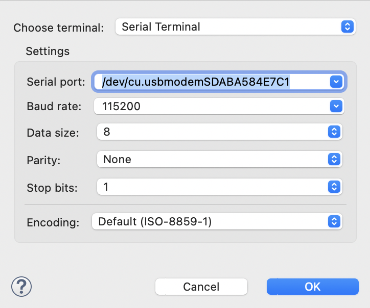
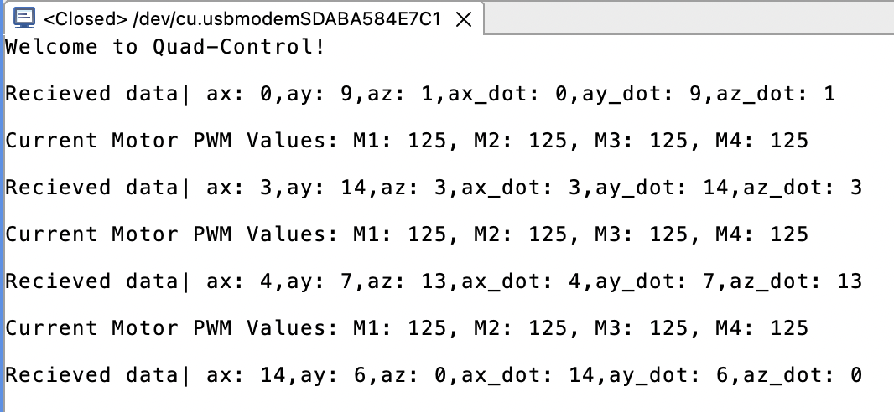

# quad-control

Drivers necessary to read IMU (Inertial Measurement Unit) and control ESC's (Electronic Speed Controllers) on hobby quadcopter. All thats left is the control law! (Based around the NXP FRDM-KL25Z MCU)

Main file is 'quad-control.c', this is where the main logic is located.

## Description: 

This repository provides a quick way to test out various control algorithms to fly a hobby quadcopter. Contained here are the necessary drivers so you can quickly get up and running with your testing without having to worry about the nitty-gritty. This software IS hardware dependent.

## Changes from Original Project Proposal

Instead of implementing a control algorithm, this project will now 'stop' at the configuration of the peripherals necessary to make the drone fly, without the controller. This includes

    -- Configuring the MCU to read IMU data over I2C
    -- Writing PWM signals to the ESC's

From here an advanced user will be able to implement any control law by taking in the IMU data with the provided functions, and write a PWM signal to the motors based on the current system dynamics.

## Required Components

    -- 'NXP FRDM-KL25Z MCU'
    -- 'LSM6DS0X 9DOF IMU'
    -- 'HW-221 3.3V to 5V Logic Stepper'
    -- 'Simonk 30A 2-4S Brushless Speed Controller (4x)'
    -- 'HF 440 Hobby Quadcopter Frame'
    -- LIPO 14.8V Battery (6000 mAh)

## Wiring / System Setup

| FRDM-KL25Z | LSMDS0X IMU | HW-221 Logic Stepper | Brushless Speed Control |
|------------|-------------|----------------------|-------------------------|
|   J9 3.3V  |     3Vo     |          N/A         |            N/A          |
|   J9 GND   |     GND     |          N/A         |            N/A          | 
|   J2 E0    |     SDA     |          N/A         |            N/A          |
|   J2 E1    |     SCL     |          N/A         |            N/A          |
|   J9 3.3V  |     N/A     |          VA          |            N/A          |
|   J1 C0    |     N/A     |          A1          |            N/A          |
|   J10 C1   |     N/A     |          A2          |            N/A          |
|   J10 C2   |     N/A     |          A3          |            N/A          |
|   J1 C3    |     N/A     |          A4          |            N/A          |
|   J9 GND   |     N/A     |          GND         |            N/A          |
|    N/A     |     N/A     |          B1          |            M1           |
|    N/A     |     N/A     |          B2          |            M2           |
|    N/A     |     N/A     |          B3          |            M3           |
|    N/A     |     N/A     |          B4          |            M4           |

## Setup Image

## Terminal Settings

Below is a screenshot of the terminal settings for this program.

## Terminal Output

Below is a screenshot of an example terminal output for this program, you will see varying accelerometer data. In this example we give a constant PWM value to Motors.

## Files (source dir contains all unique files)

    -- quad-control.c (application entry point, initiates communication pipeline from IMU to Motors)

    -- gpio_config.c (all functions created to configure Gen Purpose I/O pins on FRDM-KL25Z)
    -- gpio_config.h (header file with brief description of functions)

    -- i2c_config.c (all functions created to configure i2c communication on FRDM-KL25Z)
    -- i2c_config.h (header file with brief description of functions)

    -- imu_config.c (all functions created to configure IMU on FRDM-KL25Z to read current dynamics)
    -- imu_config.h (header file with brief description of functions)

    -- test_imu_config.c (test suite created for imu_config.c)
    -- test_imu_config.h (header file with brief description of functions)

    -- pwm_config.c (all functions created to configure PWM on FRDM-KL25Z to drive motors)
    -- pwm_config.h (header file with brief description of functions)

    -- test_pwm_config.c (test suite created for pwm_config.c)
    -- test_pwm_config.h (header file with brief description of functions)

## To download the repo

    -- git clone "https://github.com/collin-love/quad-control"